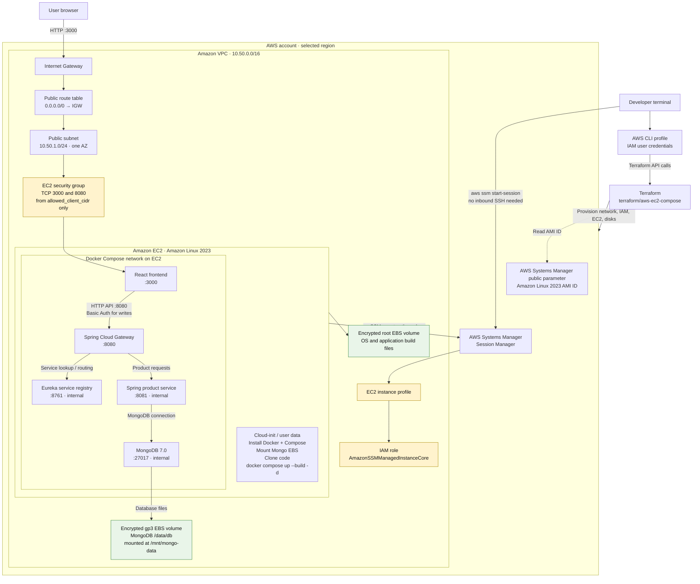
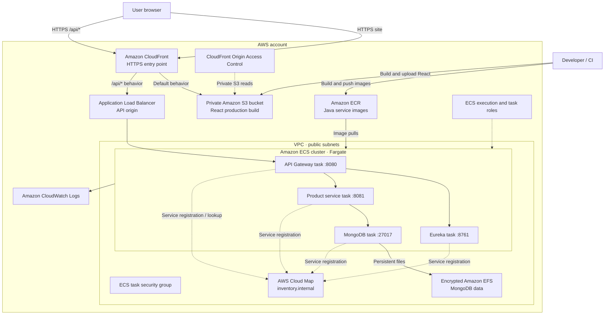

# AWS architecture diagrams

This document diagrams the AWS services and application components in this project. The **EC2 + Docker Compose** diagram is the deployment used for the educational smoke test. The ECS/Fargate diagram is a separate Terraform option in `terraform/aws`; it is not part of the EC2 deployment.

For the editable diagram using **AWS service icons**, open [`AWS-EC2-ARCHITECTURE.drawio`](AWS-EC2-ARCHITECTURE.drawio) in [diagrams.net](https://app.diagrams.net/). The diagram below is a quick text-renderable overview; the draw.io file labels the IAM principals, policies, resource boundaries, and communication ports in more detail.

The EC2, Internet Gateway, EBS, Systems Manager, and IAM symbols in the editable diagram use embedded AWS architecture icon artwork, so they render without relying on a locally installed diagram stencil library. The icons are from the [AWS Architecture Icons](https://aws.amazon.com/architecture/icons/) set; the boundaries and application components remain editable diagram shapes.

## 1. EC2 + Docker Compose deployment

### Request flow

1. The browser requests the React application on port `3000`.
2. The frontend calls the API gateway on port `8080`.
3. The gateway uses Eureka to locate the product service.
4. The product service reads or writes product documents in MongoDB.
5. MongoDB stores its database files on the separately attached EBS volume.

Only ports `3000` and `8080` are opened by the EC2 security group, and only to the CIDR configured as `allowed_client_cidr`. Eureka, the product service, and MongoDB are reachable between Compose containers, not directly from the public internet. The React development server and all application traffic use HTTP in this learning setup.

### Provisioning and access flow

- Terraform runs from the developer's computer using the configured AWS CLI profile. The IAM user needs permissions to read the AMI/availability data and create the VPC, security group, EC2 instance, IAM role/profile, and EBS volumes.
- Terraform reads the current Amazon Linux 2023 AMI ID from a public Systems Manager Parameter Store parameter.
- EC2 receives an instance profile. Its IAM role allows Systems Manager Session Manager access.
- The local AWS CLI opens an SSM session through the Systems Manager service; the instance initiates its SSM connection outbound, so no SSH ingress rule is needed.
- EC2 user data installs Docker and Compose, mounts the MongoDB disk, clones the configured Git branch, writes the public-IP configuration, and builds/starts the Compose application.

#### IAM policies are attached to different principals

There are two separate IAM permission paths. Do not confuse the permissions used to **create infrastructure** with the permissions used by the **running EC2 instance**:

| Principal | Where it is attached | What it permits in this setup |
| --- | --- | --- |
| Terraform deployment identity (`ramshy` profile) | IAM user/credentials used by local AWS CLI and Terraform | Provisioning actions for EC2/VPC, EBS, IAM role/profile, tags, and reads such as the public AMI SSM parameter. The exact permissions were manually granted during the learning deployment; they are not created by this Terraform stack. |
| EC2 instance role | IAM role attached to EC2 through its instance profile | AWS-managed `AmazonSSMManagedInstanceCore`, allowing the instance's SSM agent to register and establish Session Manager channels. |
| Developer's SSM caller identity | IAM user/profile used by `aws ssm start-session` | Needs client-side Systems Manager permissions to start and inspect sessions. This is separate from the EC2 instance role. |

The Terraform deployment identity encountered these denied actions while permissions were being configured: `ssm:GetParameter`, `ec2:DescribeAvailabilityZones`, `ec2:CreateVpc`, `ec2:CreateTags`, `iam:CreateRole`, `iam:CreateInstanceProfile`, and `iam:TagInstanceProfile`. `ec2:AllocateAddress` was needed by the original design, but the Elastic IP was removed; the current EC2 stack does not allocate one. Additional EC2/network/volume actions are also needed for the complete resource lifecycle. An administrator should derive and scope a least-privilege policy for the operations actually required; the project does not provision the deployment user's IAM policy.

### Persistence and lifecycle

- Container recreation does not erase MongoDB files because `/data/db` is bind-mounted to `/mnt/mongo-data` on the separate EBS volume.
- Replacing the EC2 instance due to a user-data change replaces the root disk, but Terraform can detach and reattach the separate MongoDB EBS volume in the same Availability Zone.
- The instance has an automatically assigned public IP, not an Elastic IP. The address can change after replacement or stop/start; use the latest `terraform output`.
- `terraform destroy` deletes Terraform-managed infrastructure, including the MongoDB EBS volume and its data. Back up important data before destroying.

## 2. Separate ECS/Fargate option in `terraform/aws`

This is the alternate, more managed architecture scaffolded in the other Terraform directory. It is **separate from** `terraform/aws-ec2-compose`; the two deployments should not be confused.

The Fargate Terraform starts ECS desired counts at zero so infrastructure and ECR repositories can be created before image publishing. It requires separate image-push and frontend-upload steps. Fargate, the load balancer, EFS, CloudFront, and network resources can incur charges; see [`README-AWS.md`](README-AWS.md) before deploying that option.

## Related guides

- [EC2 + Docker Compose deployment steps](README-AWS-EC2.md)
- [EC2 deployment learning notes and troubleshooting](AWS-EC2-LEARNING-NOTES.md)
- [ECS Fargate, S3, and CloudFront deployment steps](README-AWS.md)
